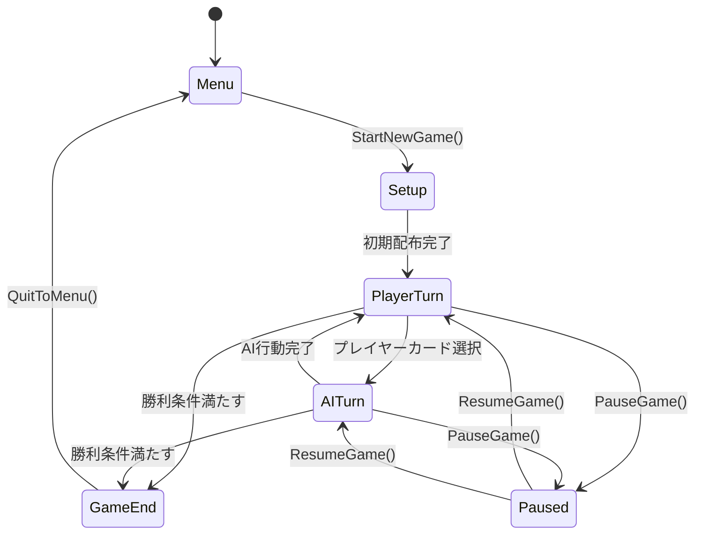

# GameManager実装ガイド

## GameManager概要

**GameManager**は、FPS Trump Gameの中枢システムで、全てのゲーム状態・ターン管理・勝敗判定を統括するシングルトンコンポーネントです。

## クラス設計

### 継承関係
```
MonoBehaviour
└── GameManager (Singleton)
    ├── IGameStateManager
    ├── ITurnManager
    └── IEventPublisher
```

## コンポーネント配置

### Unity Inspector設定
```yaml
GameManager GameObject:
  Tag: GameController
  Layer: Default
  
Components:
  - GameManager (Script)
  - AudioSource (for game events)
  - PlayableDirector (Timeline control)
  
Child Objects:
  - TurnTimer (Empty GameObject)
  - Statistics (Empty GameObject)
  - EventSystem (Empty GameObject)
```

## Inspector Fields詳細

### 📋 Core Game Components
```csharp
[Header("📋 Core Game Components")]
[SerializeField] private PlayerHandController playerHand;
[SerializeField] private AIHandController aiHand;
[SerializeField] private DiscardPile discardPile;
[SerializeField] private CardDeck cardDeck;

// Unity Inspector設定：
// playerHand: Hierarchy の PlayerHand GameObject をドラッグ
// aiHand: Hierarchy の AIHand GameObject をドラッグ
// discardPile: Hierarchy の DiscardPile GameObject をドラッグ
// cardDeck: Hierarchy の CardDeck GameObject をドラッグ
```

### 🎮 Game State
```csharp
[Header("🎮 Game State")]
[SerializeField] private GameState currentState = GameState.Menu;
[SerializeField] private int currentPlayerTurn = 0; // 0 = Player, 1 = AI
[SerializeField] private int turnCounter = 0;
[SerializeField] private float gameStartTime;
[SerializeField] private GameDifficulty difficulty = GameDifficulty.Normal;

// これらはコードで制御されるが、Inspector でデバッグ表示可能
```

### ⏱️ Timing Settings
```csharp
[Header("⏱️ Timing Settings")]
[SerializeField] private float playerTurnTimeLimit = 30f;
[SerializeField] private float aiThinkingTimeMin = 1.5f;
[SerializeField] private float aiThinkingTimeMax = 4.0f;
[SerializeField] private float turnTransitionDelay = 0.5f;

// Unity Inspector設定：
// playerTurnTimeLimit: 30 (プレイヤーターンの制限時間)
// aiThinkingTimeMin: 1.5 (AI最短思考時間)
// aiThinkingTimeMax: 4.0 (AI最長思考時間)
// turnTransitionDelay: 0.5 (ターン切り替えの間隔)
```

### 🎬 Timeline Controllers
```csharp
[Header("🎬 Timeline Controllers")]
[SerializeField] private PlayableDirector gameSequenceDirector;
[SerializeField] private PlayableDirector cardInteractionDirector;
[SerializeField] private PlayableDirector psychologyDirector;

// Unity Inspector設定：
// gameSequenceDirector: GameTimeline GameObject の PlayableDirector
// cardInteractionDirector: CardInteraction Timeline の PlayableDirector
// psychologyDirector: PsychologyPressure Timeline の PlayableDirector
```

## 状態遷移図



## 実装手順

### Phase 1: 基本構造（1日目）

#### 1.1 GameManager GameObject作成
```csharp
// Unity エディタ操作:
// 1. Hierarchy で右クリック → Create Empty
// 2. 名前を "GameManager" に変更
// 3. Tag を "GameController" に設定
// 4. GameManager.cs スクリプトを Add Component
```

#### 1.2 基本シングルトンパターン実装
```csharp
public class GameManager : MonoBehaviour
{
    private static GameManager _instance;
    public static GameManager Instance
    {
        get
        {
            if (_instance == null)
                _instance = FindObjectOfType<GameManager>();
            return _instance;
        }
    }

    private void Awake()
    {
        // シングルトン確保
        if (_instance != null && _instance != this)
        {
            Destroy(gameObject);
            return;
        }
        _instance = this;
        DontDestroyOnLoad(gameObject);
    }
}
```

#### 1.3 基本状態管理実装
```csharp
public enum GameState
{
    Menu, Setup, PlayerTurn, AITurn, GameEnd, Paused
}

[SerializeField] private GameState currentState = GameState.Menu;

public void ChangeState(GameState newState)
{
    if (currentState == newState) return;
    
    GameState previousState = currentState;
    currentState = newState;
    
    Debug.Log($"Game State: {previousState} → {newState}");
    OnGameStateChanged?.Invoke(newState);
}
```

### Phase 2: コアゲーム機能（2日目）

#### 2.1 新ゲーム開始機能
```csharp
public void StartNewGame()
{
    StartCoroutine(NewGameSequence());
}

private IEnumerator NewGameSequence()
{
    // 1. Setup状態に変更
    ChangeState(GameState.Setup);
    
    // 2. コンポーネント初期化
    yield return StartCoroutine(InitializeGameComponents());
    
    // 3. カード配布
    yield return StartCoroutine(DealInitialCards());
    
    // 4. プレイヤーターン開始
    ChangeState(GameState.PlayerTurn);
    isGameActive = true;
}

private IEnumerator DealInitialCards()
{
    // 各プレイヤーに7枚配布
    for (int i = 0; i < 7; i++)
    {
        // プレイヤーにカード配布
        CardObject playerCard = cardDeck.DrawCard();
        if (playerCard != null)
        {
            playerHand.AddCard(playerCard);
            yield return new WaitForSeconds(0.3f);
        }
        
        // AIにカード配布
        CardObject aiCard = cardDeck.DrawCard();
        if (aiCard != null)
        {
            aiHand.AddCard(aiCard);
            yield return new WaitForSeconds(0.3f);
        }
    }
}
```

#### 2.2 ターン管理システム
```csharp
private void StartPlayerTurn()
{
    Debug.Log("👤 Player Turn");
    currentPlayerTurn = 0;
    
    OnTurnChanged?.Invoke(currentPlayerTurn);
    
    // ターンタイマー開始
    if (turnTimerCoroutine != null)
        StopCoroutine(turnTimerCoroutine);
    turnTimerCoroutine = StartCoroutine(PlayerTurnTimer());
    
    // プレイヤー入力有効化
    EnablePlayerCardSelection(true);
}

private void StartAITurn()
{
    Debug.Log("🤖 AI Turn");
    currentPlayerTurn = 1;
    
    OnTurnChanged?.Invoke(currentPlayerTurn);
    
    // プレイヤー入力無効化
    EnablePlayerCardSelection(false);
    
    // AI行動実行
    if (currentTurnCoroutine != null)
        StopCoroutine(currentTurnCoroutine);
    currentTurnCoroutine = StartCoroutine(AITurnSequence());
}

private IEnumerator PlayerTurnTimer()
{
    float remainingTime = playerTurnTimeLimit;
    
    while (remainingTime > 0 && currentState == GameState.PlayerTurn)
    {
        OnTurnTimeUpdate?.Invoke(remainingTime);
        remainingTime -= Time.deltaTime;
        yield return null;
    }
    
    // 時間切れ処理
    if (currentState == GameState.PlayerTurn)
    {
        ForcePlayerSelection();
    }
}
```

### Phase 3: カード処理システム（3日目）

#### 3.1 プレイヤーカード選択処理
```csharp
public void ExecutePlayerCardDraw(int aiCardIndex)
{
    if (currentState != GameState.PlayerTurn || isProcessingTurn) 
        return;
    
    StartCoroutine(ProcessPlayerCardDraw(aiCardIndex));
}

private IEnumerator ProcessPlayerCardDraw(int aiCardIndex)
{
    isProcessingTurn = true;
    
    // ターンタイマー停止
    if (turnTimerCoroutine != null)
    {
        StopCoroutine(turnTimerCoroutine);
        turnTimerCoroutine = null;
    }
    
    // カードをAIからプレイヤーへ移動
    CardObject drawnCard = aiHand.RemoveCard(aiCardIndex);
    if (drawnCard != null)
    {
        playerHand.AddCard(drawnCard);
        audioManager?.PlaySFX("CardDraw");
    }
    
    // ペア判定
    playerHand.CheckForPairs();
    
    // 勝利条件チェック
    CheckGameEndConditions();
    
    // 次のターンへ
    if (isGameActive)
    {
        yield return new WaitForSeconds(turnTransitionDelay);
        ChangeState(GameState.AITurn);
    }
    
    isProcessingTurn = false;
}
```

#### 3.2 AI行動処理
```csharp
private IEnumerator AITurnSequence()
{
    isProcessingTurn = true;
    
    // AI思考・行動実行（AIHandControllerに委譲）
    yield return StartCoroutine(aiHand.ExecuteAITurn(playerHand));
    
    // 結果処理
    yield return StartCoroutine(ProcessAITurnResults());
    
    // 勝利条件チェック
    CheckGameEndConditions();
    
    // 次のターンへ
    if (isGameActive)
    {
        yield return new WaitForSeconds(turnTransitionDelay);
        ChangeState(GameState.PlayerTurn);
    }
    
    isProcessingTurn = false;
}
```

### Phase 4: 勝利条件・統計（4日目）

#### 4.1 勝利条件判定
```csharp
private void CheckGameEndConditions()
{
    // プレイヤーの手札が空
    if (playerHand.GetCardCount() == 0)
    {
        EndGame("Player", true);
        return;
    }
    
    // AIの手札が空
    if (aiHand.GetCardCount() == 0)
    {
        EndGame("AI", false);
        return;
    }
    
    // プレイヤーがジョーカーのみ
    if (playerHand.GetCardCount() == 1 && 
        playerHand.GetCards()[0].cardData.isJoker)
    {
        EndGame("AI", false);
        return;
    }
    
    // AIがジョーカーのみ
    if (aiHand.GetCardCount() == 1 && 
        aiHand.GetCards()[0].cardData.isJoker)
    {
        EndGame("Player", true);
        return;
    }
}

private void EndGame(string winner, bool isVictory)
{
    Debug.Log($"🏁 Game Over! Winner: {winner}");
    
    isGameActive = false;
    
    // 統計更新
    currentGameStats.winner = winner;
    currentGameStats.isVictory = isVictory;
    currentGameStats.gameEndTime = Time.time;
    
    OnGameEnded?.Invoke(winner);
    ChangeState(GameState.GameEnd);
    
    // エンドゲーム演出
    StartCoroutine(PlayEndGameSequence(winner, isVictory));
}
```

## Timeline統合

### Timeline接続方法
```csharp
[Header("🎬 Timeline Controllers")]
[SerializeField] private PlayableDirector gameSequenceDirector;

// Timelineの再生
private void PlayGameSequenceTimeline()
{
    if (gameSequenceDirector != null)
    {
        gameSequenceDirector.Play();
    }
}

// Timeline完了の検出
private void Update()
{
    if (gameSequenceDirector != null && 
        gameSequenceDirector.state != PlayState.Playing)
    {
        // Timeline完了時の処理
    }
}
```

## イベントシステム

### UnityEvent設定
```csharp
[Header("📢 Game Events")]
public UnityEvent<GameState> OnGameStateChanged;
public UnityEvent<int> OnTurnChanged;
public UnityEvent<string> OnGameEnded;
public UnityEvent<float> OnTurnTimeUpdate;

// イベント発火例
OnGameStateChanged?.Invoke(newState);
OnTurnChanged?.Invoke(currentPlayerTurn);
OnGameEnded?.Invoke(winner);
OnTurnTimeUpdate?.Invoke(remainingTime);
```

### Inspector での Event 設定
```
Unity Inspector:
OnGameStateChanged:
  - UIManager.UpdateGameState
  - AudioManager.PlayStateTransitionSound

OnTurnChanged:
  - UIManager.UpdateTurnIndicator
  - PsychologySystem.OnTurnChanged

OnGameEnded:
  - UIManager.ShowEndGameScreen
  - AudioManager.PlayEndGameMusic
```

## デバッグ機能

### Development Only デバッグUI
```csharp
#if UNITY_EDITOR
[Header("🔧 Debug (Development Only)")]
[SerializeField] private bool showDebugInfo = true;
[SerializeField] private bool enableCheatCommands = true;

private void OnGUI()
{
    if (!showDebugInfo) return;
    
    GUILayout.BeginArea(new Rect(10, 10, 300, 200));
    
    GUILayout.Label($"State: {currentState}");
    GUILayout.Label($"Turn: {currentPlayerTurn} ({turnCounter})");
    GUILayout.Label($"Player Cards: {playerHand?.GetCardCount()}");
    GUILayout.Label($"AI Cards: {aiHand?.GetCardCount()}");
    
    if (enableCheatCommands)
    {
        if (GUILayout.Button("Skip Player Turn"))
        {
            ForcePlayerSelection();
        }
        
        if (GUILayout.Button("End Game (Player Win)"))
        {
            EndGame("Player", true);
        }
    }
    
    GUILayout.EndArea();
}
#endif
```

## パフォーマンス最適化

### 重い処理の分散
```csharp
private IEnumerator InitializeGameComponents()
{
    // フレーム分散で初期化
    cardDeck.Initialize();
    yield return null; // 1フレーム待機
    
    playerHand.ClearHand();
    yield return null;
    
    aiHand.ClearHand();
    yield return null;
    
    discardPile.Clear();
    yield return null;
}

// 大量のカード処理時
private IEnumerator CheckAllCardsForPairs()
{
    int processedThisFrame = 0;
    const int maxPerFrame = 3;
    
    // カードチェックをフレーム分散
    foreach (CardObject card in allCards)
    {
        ProcessCard(card);
        processedThisFrame++;
        
        if (processedThisFrame >= maxPerFrame)
        {
            processedThisFrame = 0;
            yield return null;
        }
    }
}
```

## エラーハンドリング

### 堅牢性確保
```csharp
private void ValidateComponents()
{
    List<string> missingComponents = new List<string>();
    
    if (playerHand == null) missingComponents.Add("PlayerHandController");
    if (aiHand == null) missingComponents.Add("AIHandController");
    if (discardPile == null) missingComponents.Add("DiscardPile");
    if (cardDeck == null) missingComponents.Add("CardDeck");
    
    if (missingComponents.Count > 0)
    {
        Debug.LogError($"GameManager missing: {string.Join(", ", missingComponents)}");
        
        // 緊急停止
        enabled = false;
    }
}

public void ExecutePlayerCardDraw(int aiCardIndex)
{
    // 入力値検証
    if (aiCardIndex < 0 || aiCardIndex >= aiHand.GetCardCount())
    {
        Debug.LogWarning($"Invalid card index: {aiCardIndex}");
        return;
    }
    
    // 状態検証
    if (currentState != GameState.PlayerTurn)
    {
        Debug.LogWarning($"Cannot draw card in state: {currentState}");
        return;
    }
    
    // 処理中検証
    if (isProcessingTurn)
    {
        Debug.LogWarning("Turn is already being processed");
        return;
    }
    
    // ここで実際の処理実行
    StartCoroutine(ProcessPlayerCardDraw(aiCardIndex));
}
```

## セットアップチェックリスト

### 実装完了チェック
- [ ] GameManager GameObject作成・配置
- [ ] 必要コンポーネントの参照設定
- [ ] Timeline Directors の接続  
- [ ] UnityEvent の設定
- [ ] 各状態の遷移テスト
- [ ] カード操作の動作確認
- [ ] AI行動の動作確認
- [ ] 勝利条件の動作確認
- [ ] エラーハンドリングの確認
- [ ] パフォーマンステスト

### Inspector設定チェック
- [ ] Core Game Components (4個) 全て設定済み
- [ ] Timing Settings 適切な値設定
- [ ] Timeline Controllers (3個) 接続済み
- [ ] Game Events リスナー設定済み
- [ ] Debug設定 (Development時のみ有効)

この実装ガイドに従えば、**完全に機能するGameManager**が段階的に構築できるニャ！🎮✨

---
**Document Version**: 1.0  
**Implementation Priority**: High (全システムの中枢)  
**Estimated Time**: 4日間  
**Dependencies**: PlayerHand, AIHand, CardDeck, DiscardPile